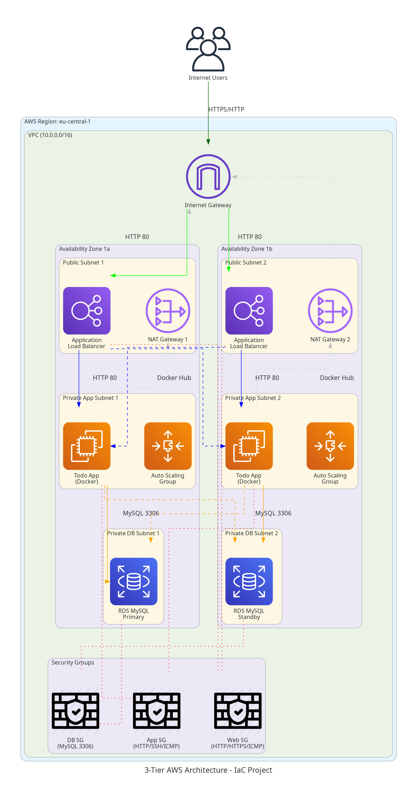
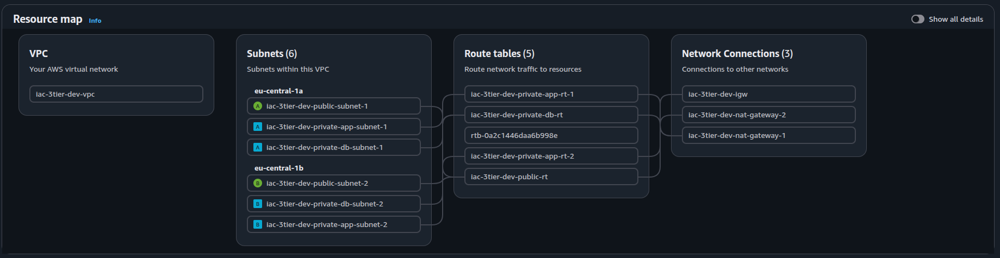
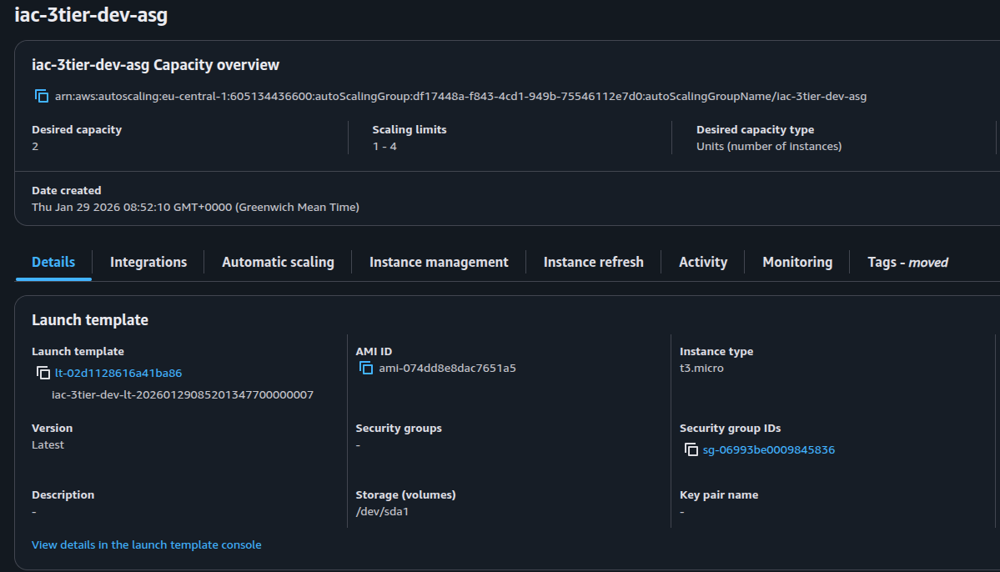
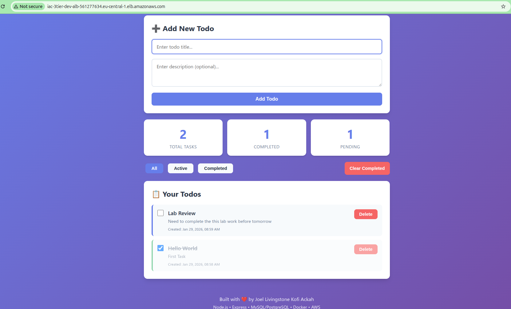
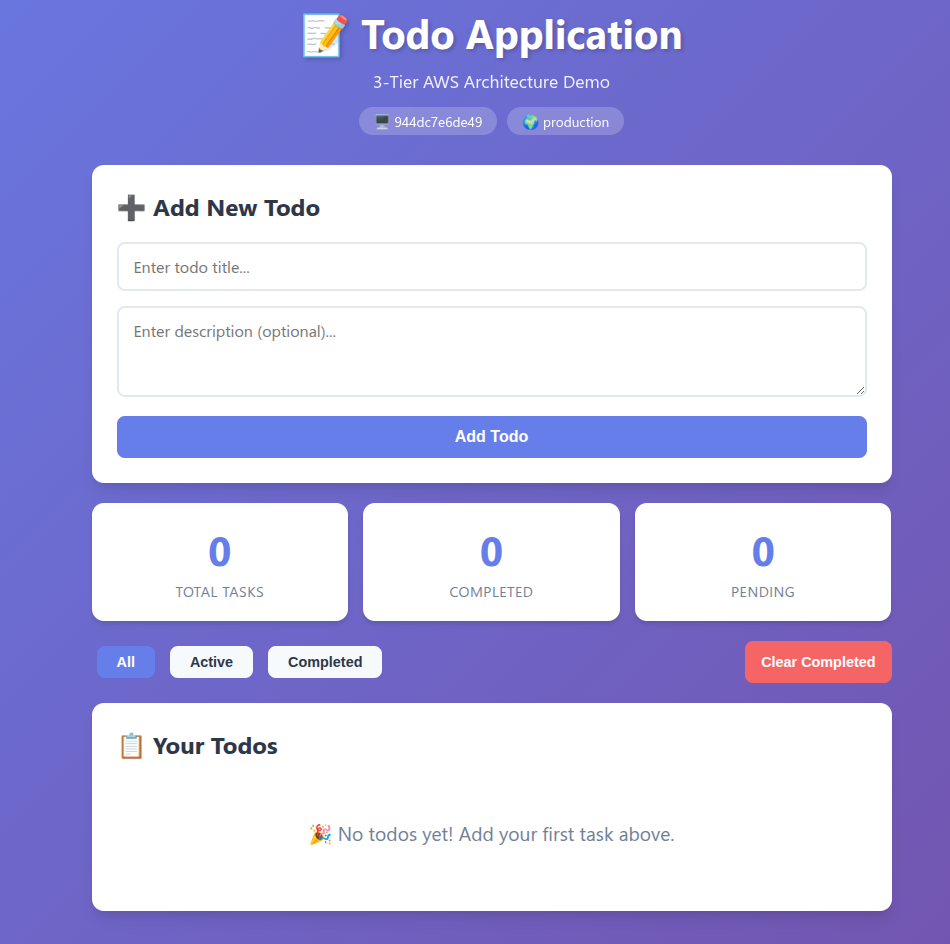

# 🚀 AWS 3-Tier Architecture with Terraform

## 📋 Table of Contents

- [Overview](#overview)
- [Architecture](#architecture)
- [Infrastructure Components](#infrastructure-components)
- [Project Structure](#project-structure)
- [Prerequisites](#prerequisites)
- [Deployment Guide](#deployment-guide)
- [Application Screenshots](#application-screenshots)
- [Infrastructure Screenshots](#infrastructure-screenshots)
- [Configuration](#configuration)
- [Security](#security)
- [Cost Estimation](#cost-estimation)
- [Troubleshooting](#troubleshooting)
- [Cleanup](#cleanup)

---

## 🎯 Overview

This project implements a **production-ready 3-tier web application** infrastructure on AWS using **Terraform Infrastructure as Code (IaC)**. The architecture follows AWS best practices for high availability, security, and scalability.

### **Key Features:**

✅ **Multi-AZ High Availability** - Deployed across 2 Availability Zones  
✅ **Auto Scaling** - Automatically scales based on demand  
✅ **Load Balancing** - Application Load Balancer distributes traffic  
✅ **Database Redundancy** - RDS Multi-AZ for automatic failover  
✅ **Secure Networking** - Private subnets with NAT Gateways  
✅ **Docker Containerization** - Application deployed as Docker container  
✅ **Infrastructure as Code** - Fully automated with Terraform modules  

### **Application:**

A **Todo List Web Application** built with:
- **Backend:** Node.js + Express.js
- **Database:** MySQL (RDS)
- **Frontend:** EJS templates with Bootstrap
- **Deployment:** Docker container from Docker Hub

---

## 🏗️ Architecture

### **3-Tier Architecture Design:**

#### **Tier 1: Presentation Layer (Web Tier)**
- Application Load Balancer (ALB) in public subnets
- Handles incoming HTTP/HTTPS traffic from internet
- Distributes traffic across multiple availability zones

#### **Tier 2: Application Layer (App Tier)**
- EC2 instances in private subnets (Auto Scaling Group)
- Docker containerized Node.js Todo application
- No direct internet access (outbound via NAT Gateway)
- Health checks via ALB

#### **Tier 3: Data Layer (Database Tier)**
- RDS MySQL Multi-AZ in private DB subnets
- Automated backups and failover
- Only accessible from application tier
- Encrypted at rest

### **High Availability Features:**

- ✅ **2 Availability Zones** (eu-central-1a, eu-central-1b)
- ✅ **2 NAT Gateways** (one per AZ for redundancy)
- ✅ **Auto Scaling Group** (min: 1, desired: 2, max: 4)
- ✅ **RDS Multi-AZ** (automatic failover to standby)
- ✅ **Cross-Zone Load Balancing** enabled

### **Architecture Diagram:**



---

## 🧩 Infrastructure Components

### **Network Layer:**

| Component | Quantity | CIDR Block | Purpose |
|-----------|----------|------------|---------|
| VPC | 1 | 10.0.0.0/16 | Isolated network |
| Public Subnets | 2 | 10.0.0.0/20, 10.0.16.0/20 | ALB, NAT Gateways |
| Private App Subnets | 2 | 10.0.32.0/20, 10.0.48.0/20 | EC2 instances |
| Private DB Subnets | 2 | 10.0.64.0/20, 10.0.80.0/20 | RDS database |
| Internet Gateway | 1 | - | Internet access |
| NAT Gateways | 2 | - | Outbound for private subnets |



### **Compute Layer:**

| Component | Quantity | Configuration | Purpose |
|-----------|----------|---------------|---------|
| Application Load Balancer | 1 | HTTP/HTTPS, Cross-Zone | Traffic distribution |
| Auto Scaling Group | 1 | Min: 1, Desired: 2, Max: 4 | Auto scaling EC2 |
| EC2 Instances | 2 | t3.micro, Ubuntu 22.04 | Application servers |
| Launch Template | 1 | Docker pre-installed | Instance configuration |



### **Database Layer:**

| Component | Configuration | Purpose |
|-----------|---------------|---------|
| RDS MySQL | db.t3.micro, Multi-AZ | Todo app database |
| Storage | 20GB gp3, encrypted | Database storage |
| Backup | Automated daily | Data protection |
| Snapshot | Manual snapshots | Recovery points |

### **Security Components:**

| Security Group | Ingress Rules | Purpose |
|----------------|---------------|---------|
| **Web SG** | HTTP (80), HTTPS (443), ICMP | ALB traffic |
| **App SG** | HTTP (80) from Web SG, SSH (22) from VPC, ICMP | EC2 instances |
| **DB SG** | MySQL (3306) from App SG | RDS database |

---

## 📁 Project Structure

```
IaC-Tier/
├── Infrastructure/                  # Terraform root module
│   ├── main.tf                     # Main infrastructure orchestration
│   ├── variables.tf                # Variable definitions
│   ├── output.tf                   # Infrastructure outputs
│   ├── provider.tf                 # AWS provider configuration
│   ├── dev.tfvars                  # Development environment variables
│   ├── staging.tfvars              # Staging environment variables
│   ├── prod.tfvars                 # Production environment variables
│   └── modules/                    # Terraform modules
│       ├── network/                # VPC, Subnets, IGW, NAT
│       │   ├── main.tf
│       │   ├── variables.tf
│       │   └── output.tf
│       ├── security/               # Security Groups
│       │   ├── main.tf
│       │   ├── variables.tf
│       │   └── output.tf
│       ├── alb/                    # Application Load Balancer
│       │   ├── main.tf
│       │   ├── variables.tf
│       │   └── output.tf
│       ├── compute/                # Auto Scaling Group, Launch Template
│       │   ├── main.tf
│       │   ├── variables.tf
│       │   ├── output.tf
│       │   ├── data.tf
│       │   └── scripts/
│       │       └── docker-user-data.sh
│       └── database/               # RDS MySQL
│           ├── main.tf
│           ├── variables.tf
│           └── output.tf
├── App/                            # Todo Application
│   ├── server.js                   # Node.js backend
│   ├── package.json                # Dependencies
│   ├── Dockerfile                  # Container definition
│   ├── docker-compose.yml          # Local development
│   ├── config/
│   │   └── database.js             # Database configuration
│   ├── views/                      # EJS templates
│   │   └── index.ejs
│   ├── public/                     # Static assets
│   │   ├── css/
│   │   └── js/
│   └── scripts/                    # Deployment scripts
│       ├── deploy.sh
│       ├── init-db.sh
│       └── user-data.sh
└── assets/                         # Screenshots
    ├── aws_3tier_architecture.png
    ├── WebApp1.png
    ├── WebApp2.png
    ├── VPC_screenshot.png
    ├── Auto_Scaling_Screenshot.png
    └── terraform output.png
```

---

## 📋 Prerequisites

### **Required Tools:**

- **Terraform** >= 1.0
- **AWS CLI** >= 2.0
- **Docker** (for local testing)
- **Git**
- **SSH Key Pair** (optional, for EC2 access)

### **AWS Account Requirements:**

- IAM user with appropriate permissions
- AWS credentials configured (`aws configure`)
- Default region: `eu-central-1`

### **Installation:**

```bash
# Install Terraform
wget https://releases.hashicorp.com/terraform/1.6.0/terraform_1.6.0_linux_amd64.zip
unzip terraform_1.6.0_linux_amd64.zip
sudo mv terraform /usr/local/bin/

# Install AWS CLI
curl "https://awscli.amazonaws.com/awscli-exe-linux-x86_64.zip" -o "awscliv2.zip"
unzip awscliv2.zip
sudo ./aws/install

# Configure AWS credentials
aws configure
```

---

## 🚀 Deployment Guide

### **Step 1: Clone Repository**

```bash
git clone <repository-url>
cd IaC-Tier
```

### **Step 2: Configure Variables**

Edit `Infrastructure/dev.tfvars`:

```hcl
# Project Configuration
project_name = "iac-3tier"
environment  = "dev"
aws_region   = "eu-central-1"

# Network Configuration
vpc_cidr = "10.0.0.0/16"

# Database Configuration
db_name     = "tododb"
db_username = "admin"
db_password = "YourSecurePassword123!"  # Change this!

# Instance Configuration
instance_type = "t3.micro"
```

### **Step 3: Initialize Terraform**

```bash
cd Infrastructure
terraform init
```

### **Step 4: Review Plan**

```bash
terraform plan -var-file="dev.tfvars"
```

### **Step 5: Deploy Infrastructure**

```bash
terraform apply -var-file="dev.tfvars"
```

**Expected deployment time:** 10-15 minutes

### **Step 6: Get Outputs**

```bash
terraform output
```


### **Step 7: Access Application**

```bash
# Get ALB URL
terraform output alb_url

# Open in browser
# Example: http://iac-3tier-dev-alb-123456789.eu-central-1.elb.amazonaws.com
```

---

## 📱 Application Screenshots

### **Todo Application - Home Page**



### **Application Features:**

✅ Add new todo items  
✅ Mark tasks as complete  
✅ Delete tasks  
✅ Real-time database updates  
✅ Responsive Bootstrap UI  



---

## 🖼️ Infrastructure Screenshots

### **VPC and Networking**

Comprehensive VPC setup with public and private subnets across multiple availability zones.


### **Auto Scaling Group**

Automatically manages EC2 instances based on demand.


### **Terraform Outputs**

All infrastructure endpoints and identifiers.


---

## ⚙️ Configuration

### **Environment Variables**

The application uses these environment variables (set via user data):

```bash
DB_HOST=<rds-endpoint>
DB_NAME=tododb
DB_USER=admin
DB_PASSWORD=<your-password>
NODE_ENV=production
PORT=3000
```

### **Docker Deployment**

EC2 instances automatically pull and run the Docker container:

```bash
docker pull livingstoneackah/todo-app:latest
docker run -d \
  -p 80:3000 \
  -e DB_HOST=$DB_HOST \
  -e DB_NAME=$DB_NAME \
  -e DB_USER=$DB_USER \
  -e DB_PASSWORD=$DB_PASSWORD \
  livingstoneackah/todo-app:latest
```

### **Health Check Endpoint**

```bash
curl http://<alb-url>/api/health

# Response:
{
  "status": "healthy",
  "database": "connected",
  "timestamp": "2026-01-29T12:34:56.789Z"
}
```

---

## 🔒 Security

### **Network Security:**

- ✅ Private subnets for application and database tiers
- ✅ No direct internet access to application servers
- ✅ NAT Gateways for controlled outbound access
- ✅ Security groups with least privilege principle

### **Data Security:**

- ✅ RDS encryption at rest (AWS KMS)
- ✅ EBS volume encryption for EC2 instances
- ✅ Database credentials via environment variables (Terraform)
- ✅ Automated database backups

### **Access Control:**

- ✅ IMDSv2 enforced on EC2 instances
- ✅ No SSH keys required (Systems Manager Session Manager recommended)
- ✅ Security group rules restrict traffic flow
- ✅ VPC flow logs enabled (optional)

### **Best Practices Implemented:**

- ✅ Principle of least privilege
- ✅ Defense in depth (multiple security layers)
- ✅ Encryption in transit and at rest
- ✅ Regular security updates (Ubuntu 22.04 LTS)
- ✅ Automated backups and snapshots

---

## 💰 Cost Estimation

### **Monthly Cost Breakdown (eu-central-1):**

| Component | Quantity | Unit Price | Monthly Cost |
|-----------|----------|------------|--------------|
| EC2 t3.micro | 2 | $0.0104/hour | ~$15.10 |
| RDS db.t3.micro Multi-AZ | 1 | $0.034/hour | ~$49.30 |
| ALB | 1 | $16.20/month + $0.008/LCU | ~$18.00 |
| NAT Gateway | 2 | $0.045/hour | ~$65.70 |
| EBS gp3 (20GB) | 2 | $0.08/GB-month | ~$3.20 |
| Data Transfer | - | Variable | ~$5.00 |
| **Total Estimated Cost** | | | **~$156.30/month** |

### **Cost Optimization Tips:**

- 💡 Use 1 NAT Gateway instead of 2 (saves ~$33/month, reduces HA)
- 💡 Use t3.micro Reserved Instances (save up to 72%)
- 💡 Enable Auto Scaling to scale down during low traffic
- 💡 Use RDS Reserved Instances for production
- 💡 Implement CloudWatch alarms to detect idle resources

---

## 🔧 Troubleshooting

### **Issue: Application Not Accessible**

**Check ALB health:**
```bash
aws elbv2 describe-target-health \
  --target-group-arn <target-group-arn>
```

**Solution:**
- Verify security group rules
- Check EC2 instance Docker logs: `docker logs <container-id>`
- Ensure RDS endpoint is accessible

### **Issue: Database Connection Failed**

**Check RDS status:**
```bash
aws rds describe-db-instances \
  --db-instance-identifier <db-identifier>
```

**Solution:**
- Verify security group allows port 3306 from App SG
- Check database credentials in user data script
- Ensure RDS is in "available" state

### **Issue: EC2 Instances Not Launching**

**Check Auto Scaling Group:**
```bash
aws autoscaling describe-auto-scaling-groups \
  --auto-scaling-group-names <asg-name>
```

**Solution:**
- Check launch template configuration
- Verify AMI is available in region
- Check EC2 service limits

### **Issue: Terraform Apply Fails**

**Common causes:**
- AWS credentials not configured
- Insufficient IAM permissions
- Resource limit exceeded
- Terraform state file locked

**Solution:**
```bash
# Refresh credentials
aws configure

# Check permissions
aws sts get-caller-identity

# Remove state lock
terraform force-unlock <lock-id>
```

---

## 🧹 Cleanup

### **Destroy Infrastructure:**

```bash
cd Infrastructure

# Review resources to be destroyed
terraform plan -destroy -var-file="dev.tfvars"

# Destroy all resources
terraform destroy -var-file="dev.tfvars"
```

**⚠️ Warning:** This will permanently delete:
- All EC2 instances
- RDS database (including all data)
- Load balancers
- NAT Gateways
- VPC and subnets

### **Manual Cleanup (if needed):**

```bash
# Delete any orphaned EBS volumes
aws ec2 describe-volumes --filters "Name=status,Values=available"

# Delete unused Elastic IPs
aws ec2 describe-addresses --filters "Name=domain,Values=vpc"

# Delete unused security groups
aws ec2 describe-security-groups --query 'SecurityGroups[?VpcId==`<vpc-id>`]'
```

---

## 📚 Documentation

### **Additional Resources:**

- [Terraform AWS Provider Docs](https://registry.terraform.io/providers/hashicorp/aws/latest/docs)
- [AWS Well-Architected Framework](https://aws.amazon.com/architecture/well-architected/)
- [Docker Documentation](https://docs.docker.com/)
- [Node.js Best Practices](https://github.com/goldbergyoni/nodebestpractices)

### **Project Documentation:**

- [`App/README.md`](App/README.md) - Application documentation
- [`Infrastructure/IMPLEMENTATION_SUMMARY.md`](Infrastructure/IMPLEMENTATION_SUMMARY.md) - Infrastructure details
- [`diagram/DIAGRAM_GUIDE.md`](diagram/DIAGRAM_GUIDE.md) - Diagram editing guide

---

## 🚀 Future Enhancements

### **Potential Improvements:**

- ❗ Using ECR instead of Docker Hub
- 🔄 Add CI/CD pipeline (GitHub Actions, GitLab CI)
- 📊 Implement CloudWatch monitoring and alerts
- 🔐 Add AWS Secrets Manager for credentials
- 🌐 Add Route 53 for custom domain
- 📜 Implement CloudTrail for audit logging
- 🔄 Add ElastiCache for Redis caching
- 📦 Implement S3 for static asset storage
- 🔒 Add WAF for web application firewall
- 🌍 Multi-region deployment
- 📈 Enhanced monitoring with Grafana

---